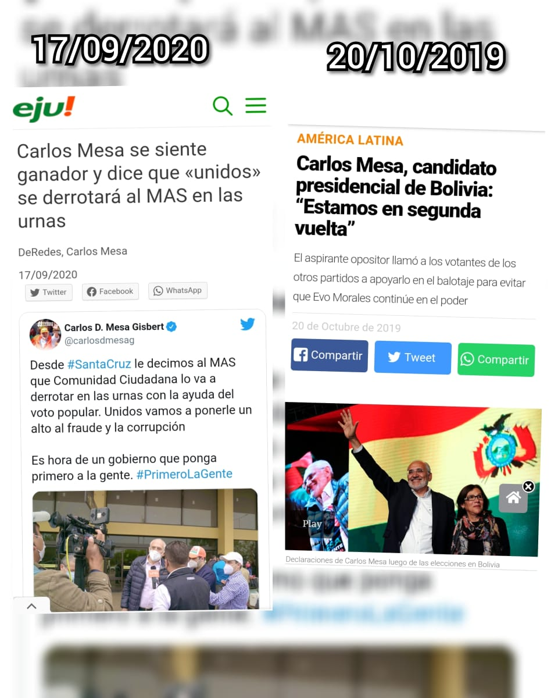

Lo sucedido en Bolivia durante el año 2019, en octubre, aunque muchos lo duden fue un GOLPE BLANDO, durante varios años hemos visto muchos casos(sobretodo en América Latina y Oriente medio) de este tipo de mecanismos para derrocar gobiernos con mecanismos no convencionales.

Lo que  varios no se dan cuenta es que la metodología de golpes blandos creada por Shene Sharp para derrocar Gobiernos, estaba ya puesta en marcha en Bolivia desde el 2016 ( más allá de la atinada o desatinada decisión del compañero Evo de hacer referéndum y realizar una repostulación) es necesario señalar que varios los pasos propuestos por Sharp para realizar golpes fueron ejecutados en Bolivia ,así como en otros países de la región.

Sobre esto sabemos mucho, conocemos los casos y tenemos los ejemplos , que estuvieron ahí ,pero no se hizo caso a las advertencias interpuestas durante octubre y noviembre del 2019, pero no tiene sentido hablar sobre lo pasado, teniendo ya dentro poco tiempo una elección para definir a nuestra máxima autoridad del Estado Plurinacional; pero es importante señalar que **aunque en el manual de sharp establece pasos para derrocar Gobiernos debo resaltar que también podrían utilizarse para derrocar procesos democráticos para elegir autoridades.**

Los primeros 3 pasos para derrocar gobiernos de Gene Sharp y su posible aplicación al proceso electoral serian:

Primera etapa: Ablandamiento. **Consiste en desarrollar matrices centradas en déficit reales o potenciales; creación de conflictos** y promoción de descontento; promoción de factores de malestar, entre los que destacan desabastecimiento, criminalidad, inseguridad, manipulación de dólar, paro patronal y otros; denuncias de corrupción, **promoción de intrigas sectarias y fracturas de unidad**.

En el caso Boliviano, esto va asociado a **crear en el imaginario colectivo la idea de que EXISTE YA UNA SEGUNDA VUELTA O BALOTAJE** entre Carlos Mesa y Luis Arce, pese a que todas las encuestas señalan a Lucho Arce como 1er opción ganadora y en algunos casos como en el encuesta más grande que realizó Jubileo con el 40% de votos válidos y diferencia de más del 10%  con el 2do lugar,que en este caso es Carlos Mesa, teniendo presente un elevado porcentaje de indecisos ( que lógicamente NO TODOS votarían por Carlos Mesa)

Pese a este análisis los partidarios de Carlos Mesa , encuestadoras y medios de comunicación señalan que existirá una 2da vuelta.

Segunda etapa: Deslegitimación. **Aquí entra en juego la manipulación de los prejuicios ideológicos, anticomunismo por ejemplo;** impulso de campañas publicitarias en defensa de la libertad de prensa, derechos humanos y libertades públicas; acusaciones de totalitarismo y pensamiento único; fractura ético-política

Acá al margen de manejar los prejuicios ( anti Masismo asociado al supuesto  fraude electoral que ya fue desacreditado por varias organizaciones de prestigio internacionales y al racismo camuflado de regionalismo- nacionalismo propuesto por Camacho ) en el caso Boliviano se deslegitimara los resultados y la credibilidad del Tribunal Supremo Electoral y se afirmará que existió Fraude electoral(otra vez ) puesto que como vimos en el ejemplo anterior ya se ha creado en el imaginario colectivo la idea de que si o si: EXISTE BALOTAJE.

Tercera etapa: calentamiento de calles. **Fomento de movilizaciones callejeras; elaboración de una plataforma de lucha que globalice las demandas políticas y sociales; generalización de todo tipo de protestas, exponiendo fallas y errores gubernamentales; organización de manifestaciones, trancas y tomas de instituciones públicas sin respeto a las instituciones que radicalicen la confrontación**.

Una vez consolidado las situaciones anteriormente planteadas, los perdedores verán de convocar a las calles a la gente( como lo hicieron en la anterior elección), para generar una situación de inestabilidad y promover enfrentamientos entre Bolivianos, que en este caso al igual que la anterior elección  sacarán todo el artefacto represor en contra del pueblo.

Como se observa, los mecanismos que usa Gene Sharp no solo son útiles para derrocar gobiernos ,sino tambien para derrocar cualquier tipo de proceso. 

La finalidad del presente artículo es advertir al ciudadano de este escenario ( que espero sinceramente no suceda) para que cuando las oligarquías dueñas de los medios de comunicación  y  actualmente también dueños del Poder Político señalen el supuesto " fraude" y convoquen a " defender" el voto y su democracia elitista, el pueblo entero tenga conocimiento de ello.

Son tiempos oscuros con una posible luz al final del túnel: una victoria clara de una mayoría que tuvo sangre y muerte  en Senkata y Sacaba, una mayoria que rescata los valores ancestrales comunitarios, sin racismo y sin discriminación, con igualdad entre los hombres y mujeres, con soberanía nacional y crecimiento.

Por último para quienes desconozcan :El golpe blando se gestó desde el 2016 con un supuesto  hijo, continuó con incendios en  la CHIQUITANIA ( ahora arde peor pero nadie se rasga las vestiduras) y por último denotan un fraude electoral desacreditado actualmente por prestigiosas entidades internacionales.

Saludos y no les digo que voten útil... voten inteligente, voten en contra del racismo, la discriminación, voten por la estabilidad que tuvieron en 14 años, voten por la soberanía, voten por alguien que está orgulloso de ser Boliviano y no por un cobarde que se enorgullece de tener pedigree Español.

Pd: Hubo errores en 14 años, si,  pero el momento histórico exige elegir entre quien defendió a los más humildes y quien defendió a un gringo y a las transnacionales.