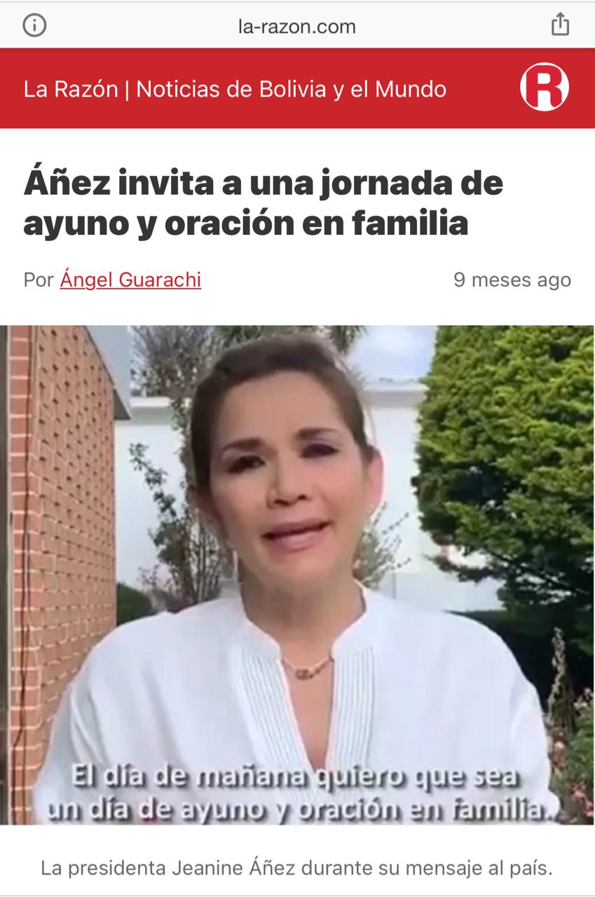

El presidente electo con el 55 % de los votos en el país, Lucho Arce, contextualizó en ocasión de la designación del nuevo Ministro de Salud, del Dr. Jeison Auza, el término que usó para enfatizar la voluntad, como refuerzo interno a la lucha contra el COVID-19. El aguantar, término que ha sido diseminado mediáticamente en sentido negativo, como algo similar a la resignación impuesta por una autoridad. Por el contrario de lo mediático, esta apropiación conceptual no condice con el espíritu del emisor. Hablar del lenguaje, es hablar de los problemas y el ruido que puede distorsionar la comunicación, y vaya que son los medios de comunicación tradicionales, son las principales barreras que tenemos, para comprender lo que se nos comunica.

Saltan en redes sociales, memes atacando al presidente, hasta cartas consideradas emotivas por periodistas son replicadas, con la intencionalidad de calcular la respuesta, a lo que ellos mismos quieren insertar en el colectivo imaginario, como un error, el haber usado el término “aguantar”, sin embargo, no considero que éste lo sea, porque cada uno en su entorno, día a día, hace lo posible por aguantar una enfermedad que cobra vidas, que no solo viene y te lleva, te destroza, hace añicos tu semblante y te lleva a sufrir crisis. Aguanto diariamente, el tener que usar barbijo todo el día, porque no es normal, ni natural usarlo, pero es necesario hacerlo y por eso lo aguanto. Aguanto tener que subirme a un minibús repleto y sin ventanas abiertas, porque necesito ir a trabajar. Aguanto no poder ir a visitar a mis padres, por temor a contagiarles, por si fuera portador del virus, aguanto la angustia de su ausencia, pero es necesario hacerlo. Aguanto, porque viene de allí la voluntad, la fuerza de seguir.

Es fácil generar una tergiversación de un término que, por supuesto sin la ayuda maliciosa de los medios de comunicación, no se convertirá jamás en el que hablar de los días, por ejemplo, en el hipotético que los medios de comunicación habrían actuado el año pasado, de igual manera que ahora: el aguantar a una señora autoproclamada, que pedía jornadas de ayuno y oración, habría sido polémica, y hasta ahora espero noticias sobre los respiradores que su yerno, el gran científico nos había conseguido magnamente.

Aguanté el año pasado, ver las calles militarizadas, tener que ser cuestionado y maltratado por estos gorilas. No se ha escrito suficiente sobre los vejámenes diarios cometidos por estos plomos, pero no es materia del presente. Aguanté ver, como los medios alababan los bonos de la autoproclamada, sin criticar en nada, las filas de contagios provocadas en los mismos bancos, por ir a cobrarlos. Aguanté casi sin esperanza, el patrocinio de grupos paramilitares, el racismo y la mentira. Aguanté ver cómo se gastaba en recorridos de helicópteros, a curas bendiciendo mi llajta, para que desaparezca el virus, sin ninguna crítica de los medios, o de los que naturalmente debían haberse sentido ofendidos, los profesionales en la salud; que en el ejercicio de su profesión sufrieron bajas y “aguantaron” calladitos, sin paros ni protestas. Bueno no hay que asombrarse mucho, si fueron ellos los agoreros secuaces del golpe de estado, hablo de los médicos devotos de la dirigencia del Colegio Médico. Y es que, a pesar de que no se les había creado un solo nuevo ítem en salud, no dijeron nada.  Y qué de lo que pasó en pleno encierro, la violencia, la crecida del feminicidio, la depresión infantil, la clausura del año escolar, se aguantó también. Se aguantaron también los robos constantes de las clínicas privadas, hicieron fortuna con la muerte. Y aguanté, aguantamos 3 o 4 postergaciones de elecciones, con la excusa de picos de contagios, aguanté a un gobierno que utilizó la pandemia para prorrogar su poder. 

Hoy que puedo volver a expresarme libremente, que mis derechos han sido repuestos a partir de la asunción de Lucho, que hay un camino trazado para salir de la crisis económica, que hay un plan de salud (diagnóstico, tratamiento e inoculación), con el horizonte claro y en democracia, desde mi lugar, aguantaré esta pandemia, pero a diferencia del año pasado, aguantaré bien y mejor. 

Ariel Percy Molina Pimentel “El Molinario”. 
Abogado y Militante MAS – IPSP 
Miembro del Colectivo “La Vanguardia”
