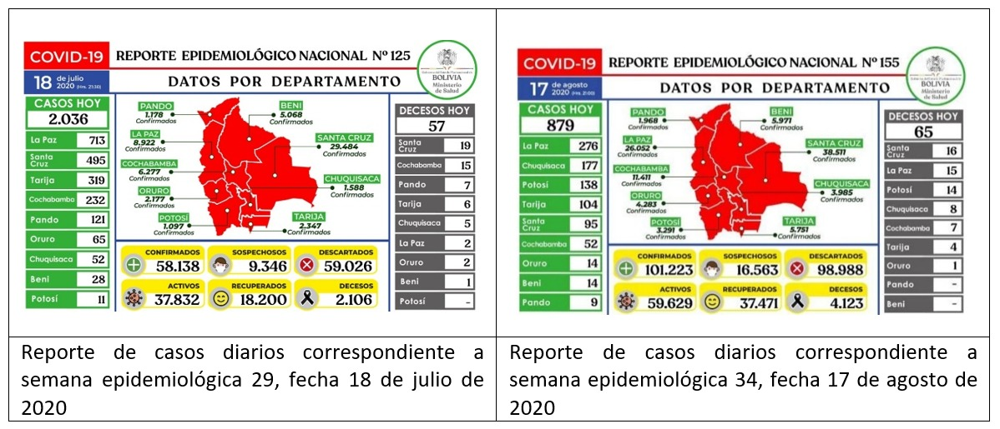

--- 
title: Análisis del comportamiento en la pandemia
subtitle: Bolivia&#58; ¿será que pasamos el pico de la pandemia y nadie se dio cuenta?
date: '2020-08-18'
slug: analisis-comportamiento-pandemia
categories:
  - articulos
tags: []
authors: 
- Colectivo_Sinchi_Warmis
publication_types:
  - '0'
summary: ''
featured: yes
---

Transcurridos más de 160 días desde el inicio del brote de la COVID-19 en el país, el comité científico del gobierno transitorio en base a sus ¨sabias proyecciones¨ hizo que el Tribunal Supremo Electoral hace varias semanas atrás cambie la fecha de las elecciones (debido a que el pico de la pandemia como país se presentaría durante el mes de septiembre) a raíz de ese informe se justificó el cambio de fecha de elecciones en Bolivia, las repercusiones de esta decisión por parte del TSE no se dejaron esperar y varios grupos de la sociedad liderada por la Central Obrera Boliviana (COB), inicio una serie de movilizaciones y bloqueos a nivel nacional, oponiéndose a este nuevo cambio de fecha, que no solo significa prorrogar el tiempo de mandato del gobierno de transición que lleva ya 8 meses, sino que a su vez esta situación permite prolongar la crisis política que vive el país desde el mes de noviembre del año pasado, sin mencionar que de este modo se dilatan las posibilidades de establecer políticas estructurales que hagan el abordaje de la crisis económica, crisis de sanitaria y que solo un gobierno democrático lograría concretar. 
Es así que, a través de un análisis de la coyuntura, buscamos ciertas respuestas en el comportamiento de la pandemia en el país y nos llamó la atención lo siguiente:

Según el comportamiento de la COVID-19 en Bolivia por semana epidemiológica se observa que durante la Semana Epidemiológica 29 (periodo de tiempo comprendido entre el 12 y 18 de julio) se registra el pico de casos más altos en el país y a partir de esta semana se establece una meseta de casos elevados hasta la Semana Epidemiológica 33.

A un mes del pico más alto alcanzado como país se ve que en los últimos días la cantidad de casos van disminuyendo según los reportes diarios del Ministerio de Salud. A consecuencia de este comportamiento de la pandemia surgen interrogantes entre profesionales del área de salud principalmente epidemiólogos y salubristas, mismas que ponemos a consideración de los lectores:

*	¿Será que el comité científico del gobierno transitorio cometió un error en sus proyecciones? ¿Ese análisis fue intencional? 
*	¿Por qué el Ministerio de Salud no hace un análisis completo del comportamiento de la pandemia para trasmitir certezas a la población, y en lugar de aquello se genera cada vez más incertidumbres?
*	Si el comité científico hizo estas proyecciones desde la óptica de salud pública se entiende que estas mismas proyecciones sirven para la adopción de medidas sanitarias que propicien la prevención de la trasmisión de la enfermedad y evitar efectos adversos, en base a esto nos preguntamos ¿Qué políticas públicas se implementaron a raíz de las afamadas proyecciones en favor principalmente de grupos de población vulnerable y población general?
*	Las demandas sociales eran tildadas de irracionales, pero a raíz del análisis de la situación epidemiológica actual del país. ¿Estaban en lo cierto?, Entonces ¿Era necesario un nuevo cambio de fecha de elecciones y con ello la generación de descontento en la sociedad y por ende reclamos?

El lector al responderse estas interrogantes caerá en cuenta de que lo preocupante en este tiempo no solo es el mal abordaje de las múltiples crisis que vive el país sino también, como pasaremos en la historia y como recordaran este periodo de tiempo las futuras generaciones.

En fin, solo el tiempo nos dirá cuál ha sido la realidad como país, sin embargo, ante tanto desatino por las autoridades de gobierno actuales, hechos de corrupción, reclamos y demandas sociales, es la población en general quien sufre las consecuencias en especial la población más pobre, este grupo poblacional que ha engrosado sus filas en los últimos meses.