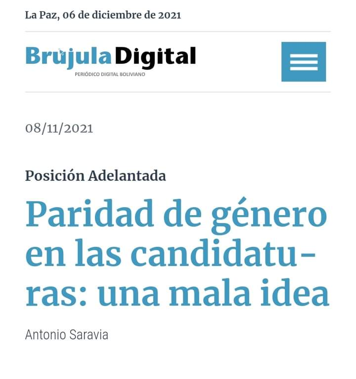

Esperando mi vuelo *(retrasado)*, terminé de ver en Netflix una película llamada **"Antonia: Una Sinfonía"**, una película que muestra como ser *'mujer'* en la primera mitad del  Siglo XX *(y obviamente cientos de años atrás)*, era realmente el modelo de ser hija, esposa y madre, siguiendo el estereotipo de género, entendiendo este último como una serie de creencias o ideas naturalizadas en una sociedad sobre cuál es o debería ser el rol de los hombres y las mujeres. 

En la película se habla de una mujer europea, radicada en los EEUU, que sueña con ser algo más que el estereotipo de mujer de aquellos tiempos conservadores, ella quiere ser Directora de Orquesta. Para ello, tiene que pasar momentos incómodos e irrespetuosos como burlas, ofensas y hasta acoso sexual para lograr su sueño. De hecho, logra ser la primera mujer en dirigir la Berliner Philarmoniker y la New York Philharmonic Orchestra, sin embargo no se encuentra ni en los 20 ó 50 Directores *(as)* de Orquesta más importantes de los último 100 años a la fecha. Me pregunto ¿cuántas de nosotras y nuestras antepasadas tuvieron que pasar por ello para ser algo más fuera del arquetipo patriarcal y religioso? Y una vez más, reconozco a una mujer fuerte que tuvo que tragarse sapos y culebras para ser algo más. 

La película muestra una parte generalmente no explorada cuando se habla de igualdad de género, paridad, y derechos para las mujeres, y es el arte en sí y ahora particularmente la música, en este caso el privilegiado lugar que tiene la música clásica.

Pero el post no es sólo para hablar una vez más sobre lo que pasó antes, sino lo que sigue pasando ahora con muchas de nosotras en el Estado, en la política, en las empresas, en las instituciones, en organismos internacionales, en  bancos y hasta en las Orquestas; si hay direcciones dirigidas por nosotras generalmente son inviabilizadas y poco o nada mediáticas, además que siguen siendo espacios ocupados por más hombres que por mujeres. 

A eso se suma un artículo retrógrada de un tal Antonio Saravia que se llama **"Paridad de género en las candidaturas: una mala idea"** en la que cuestiona la Ley 1096 de Organizaciones Políticas sancionada el 2018. En él, especificamente menciona que los espacios para mujeres son simplemente para llenar cuotas sin mérito y sin capacidad. Argumenta que **"Cuando vemos una mujer en la lista no sabemos si esta está ahí por méritos o porque había que llenar la cuota. La ironía entonces es que las cuotas ahuyentan a las mujeres con el mérito y las cualidades para ser candidatas. Las mujeres que tienen esos méritos y esas cualidades se respetan a sí mismas y rechazan ser elegidas por una cuota"**. Reduciendo las actividades de las mujeres a tareas más **"nobles"**.

¿Por qué tal realidad desde la política hasta el arte?  Porque existen personas como Antonio Saravia, con una limitada mirada de la realidad política y el rol fundamental de las mujeres, sin dejar de mencionar que es realmente miserable leer a un hombre **“macho”** hablando de reivindicaciones femeninas que, por los visto, jamás respetó ni respetará. Porque es evidente que las féminas estamos ocupando espacios, muchas veces a codazos, en las que los hombres, sin méritos ni capacidad ocupan sólo por el hecho de ser hombres y eso incómoda. Porque la lucha contra el patriarcado es real, por lo que la lucha se asienta también contra el sistema liberal, capitalista y por supuesto, colonial y ésto demuestra, una vez más la violencia patriarcal que se manifiesta contra nosotras. 

Romper con el imaginario social de los siglos pasados de qué es y cómo ser mujer, es la tarea de mujeres y hombres. Como sociedad, como Estado e instituciones hay que eliminar situaciones de desigualdad y discriminación con marcos legales y espacios más justos que conlleven a una sociedad más equitativa. Nosotras las mujeres no vamos a renunciar a nuestros derechos conquistados por mujeres que lideraron en diversas áreas, desde la política hasta el arte, la reivindicación de capacidad y mérito.

Por: Claudia Herbas 
