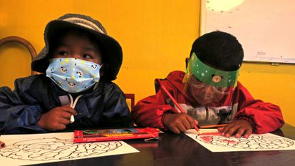

De vuelta a clases, después de las vacaciones de invierno, aún es normal escuchar que la Educación es primordial para el progreso de la familia y el desarrollo de un país. En esa tónica, nuestra Constitución Política del Estado (**CPE**) en su artículo 77 señala que la Educación es una de las funciones supremas del actual Estado Plurinacional y su dimensión normalmente se centra en el proceso de enseñanza y aprendizaje entre el Educador y el Educando, siendo la diversidad cultural uno de los pocos estudios con enfoque social de la lectura educativa, se hace necesario ver otros aspectos sociales que merecen ser atendidos, como el rol de los actores sociales en la educación.

El Estado, a través de la Ley de la Educación *“Avelino Siñani – Elizardo Pérez”*, regula al Sistema Educativo de Bolivia, siendo Educación Regular uno de sus Subsistemas, compuesto por: 
1. Educación Inicial
2. Primaria  
3. Secundaria

Ahora bien, la Ley menciona que los profesionales en Ciencias de la Educación y Pedagogía son profesionales que apoyan y fortalecen el Sistema Educativo, con la única salvedad que nunca podrán incorporarse al Escalafón Docente.

Esta disposición legal alcanza también a la gestión del Sistema Educativo, compuesto por las Direcciones Departamentales de Educación, Direcciones Distritales Educativas, Direcciones de Núcleo y Direcciones de las Unidades Educativas, mismas se limitana la modalidad de designación en marco del reglamento del *“escalafón”*, por lo cual los profesionales en Ciencias de la Educación, no pueden ni podrán acceder a estos cargos cuya finalidad es implementar las políticas educativas ¿Entonces en que ámbito Educativo, apoyan y fortalecen los profesionales en Ciencias de la Educación al Sistema Educativo Plurinacional?.

Bajo el argumento de que *“la educación no se privatiza”* se ha permitido mantener un orden legal que discrimina a los profesionales y futuros profesionales de Ciencias de la Educación. Todo esto nos trae a colación la Ley Contra el Racismo y toda Forma de Discriminación, en donde se indica que también una forma de discriminación, es la exclusión basada en la profesión, como se da en el presente caso, toda vez que se deja a la suerte a los profesionales en Ciencias de Educación, a pesar de que la Ley de la Educación *“Avelino Siñani – Elizardo Pérez”*, les da facultad de fortalecer a todo el Sistema Educativo, pero en la práctica, amparados por la misma Ley, se les excluye.

Viendo esta situación de desigualdad legal, se debería corregir por iniciativa del Órgano Legislativo o consultar al Tribunal Constitucional Plurinacional, sobre la constitucionalidad de algunos artículos de la Ley Nº 070 que discrimina a los profesionales en Ciencias de Educación, sin embargo, las salidas legales, si bien apoyan a las causas justas, no son suficientes para mejorar la Educación, esta pues pasa por una planificación que genere un movimiento de conciencia que incluya a todos los actores pedagógicos y no solamente a un solo sector.

Tomar conciencia que la escuela no es un espacio cerrado y de propiedad exclusiva de aquellos que pertenecen al Escalafón, es también, una tarea prioritaria tanto de las Carreras de Ciencias de la Educación de las Universidades Públicas y Privadas, así como de la ciudadanía en general, teniendo un rol protagónico para generar propuestas, las cuales deben ser debatidas e implementadas paulatinamente por el Ministerio de Educación y así eliminar la separación que existe actualmente entre Estado – Universidad – Sociedad Civil y aún en estos tiempos de pandemia que atraviesa nuestro país, se necesita el trabajo coordinado de todos los sectores sociales.

Por:

**Erick Gonzalo Flores Zenteno** 
*Abogado y sociólogo*

