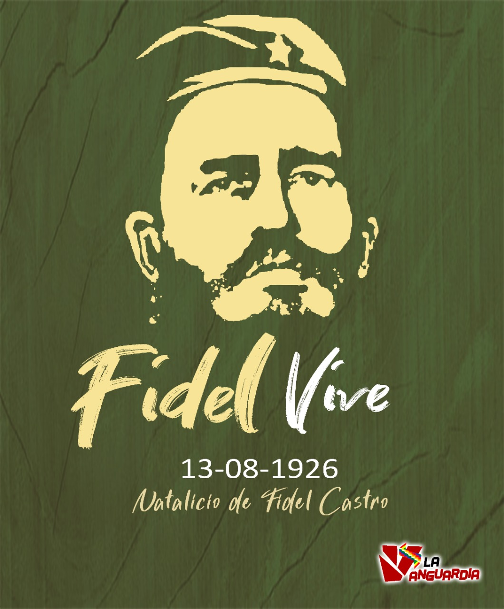

Son más de 60 años de bloqueo económico perpetrado por el Gobierno de Estados Unidos hacia la Revolución cubana, mismo que se recrudeció desde la caída del campo socialista, para el que no logra dimensionar la situación referente *(sobretodo el ciudadano Boliviano)* es importante tener presente que aquel pequeño país a tan solo 90 millas del País que lanzó 2 bombas atómicas y que va realizando guerras para retornar la **"democracia"** a países que tienen petróleo no haya conseguido doblegar a este pequeño **“David”**. 

Muchos dirán *¿por qué?* La respuesta mucho más allá que una guerra por apoderarse de los RRNN de esa pequeña isla y de toda su riqueza turística es más profundo, durante muchos años la pequeña isla a diferencia de otros países con mayores recursos naturales decidió invertir en conocimiento, profesionales éticos y sobretodo revolucionarios, Comandante en Jefe visualizó desde mucho antes que la batalla que se desarrollaría no sería con armas sino con **IDEAS** y decidió denominar a todos los militantes y brigadistas como Soldados de las Ideas, con conceptos tan sencillos pero fuertes que nos llevan a valorar cada vez nuestro sentimiento revolucionario, aplicar los preceptos del gran José Martí en su **"ser cultos para ser libres"** y **"patria es humanidad"** así decidió empezar a mandar soldados de las ideas con visión humana para apoyar los lugares en los cuales las elites académicas y médicas no quieren llegar: los barrios marginales y los sitios arrasados por desastres naturales, guerra y pobreza.

Ahí nacen los programas: **"Yo Si Puedo"**, proyecto de alfabetización vanguardia y así también nacen las brigadas médicas internacionalistas como son **barrio adentro**, **misión milagro**, **brigada médica Henry Reeve** puesta consideración para ser acreedora al premio Nobel de La Paz.

Hasta el 2020 eran 59 países los cuales fueron beneficiarios de la solidaridad internacionalista de la Revolución Cubana, más de 20000 profesionales de la salud movilizados en diversos países, llevando salud a donde el neoliberalismo llevó guerra, pobreza y desesperación.

Entre el 2002 y el 2016 se ha alfabetizado con el **"Yo Si puedo"** a casi diez millones de personas de 130 países.

Ya en el Estado Plurinacional hasta que se da el [#GolpeDeEstadoEnBolivia](#GolpeDeEstadoEnBolivia) en el 2019, la brigada Médica Cubana realizó 272838 cirugías generales, 727238 cirugías oftalmológicas, asistieron 60792 partos y salvaron 117546 vidas durante su estancia.

El programa de alfabetización Yo Si Puedo en el Estado Plurinacional logró enseñar a leer y escribir a 1 millón de personas, de los cuales la mayoría de ellos son adultos mayores, logrando declarar a Bolivia el 2008 país libre de analfabetismo.

La Revolucion Cubana además de mandar médicos y educadores también decidió otorgar más de 5000 becas para formar académicamente a profesionales en salud e ingeniería con una visión humana No mercantilista para continuar el legado internacionalista del comandante en jefe.

Las oligarquías, elites y las falsas democracias lo llamaban dictador, otros lo llamamos la praxis del hombre nuevo que llevó salud, vida y educación a donde las democracias mandaron bombas y muerte.

El Estado Plurinacional de Bolivia y otros cientos de países tenemos una deuda histórica con la Revolución Cubana y su líder histórico que en el 13 de agosto cumple 95 años.
En octubre de 1953 señalaba el comandante Fidel Castro: **"Condenadme, no importa, la historia me absolverá"**

Hoy con creces podemos afirmar que ello no únicamente se cumplió a nivel de la hermana República Cuba, sino a nivel mundial, en el corazón de todos aquellos que vemos el internacionalismo puro en su obras y actos.

[#FidelPorSiempre](#FidelPorSiempre) 
**¡Hasta la Victoria, siempre!,** 
**¡Patria o muerte, venceremos!**

Gabo Campero Nava 
Miembro del Colectivo **“*La Vanguardia*”** 
Militante del **MAS** y del **Proceso de cambio**. 
