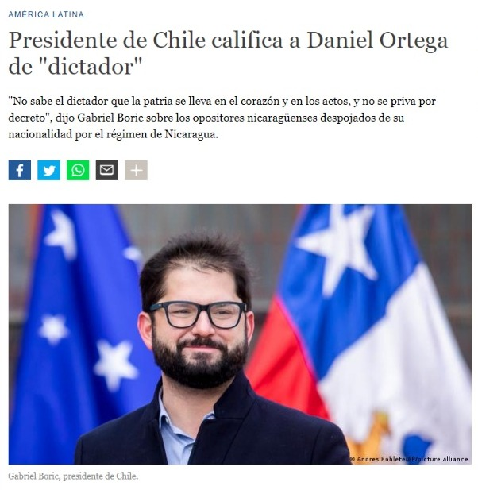

Días atrás se veía como el joven presidente de Chile, Gabriel Boric arremetía contra Daniel Ortega y las medidas de su gobierno, en cuanto a las determinaciones de despojar de nacionalidad a los que sean considerados traidores a la patria.

La finalidad del presente articulo no esta en atacar a Nicaragua, tampoco a Boric, la finalidad del presente articulo es priorizar e identificar al enemigo y no dar insumos a esa ya muy poderosa masa mediática privada internacional, quien amplifica ese comentario del presidente de Chile, el cual tilda de dictador a Ortega.

Personalmente creo que es un error y una desviación del objetivo histórico, ir contra alguien que ha impulsado educación, salud en su país, pero mas preocupante que eso, es el no pronunciamiento por otras atrocidades en el mundo, sin ir muy lejos tenemos aun la cárcel de Guantánamo en Cuba, donde los Gringos perpetraron las peores barbaries contra los **DDHH**, tenemos una gran cantidad de violaciones de **DDHH** debidamente documentadas y ejecutadas por el Tío Sam en medio oriente, todas con la complicidad del gobernante de turno de Estados Unidos y que hasta la fecha no tienen una sanción y no veo al joven presidente, denunciar y estrellarse contra esas barbaridades, (*o capaz lo hizo pero nadie, ningún medio le dio importancia*), ni tampoco contra la situación en Palestina y los constantes abusos de Israel, asesinatos de niños, torturados y una cantidad de personas despojadas de **TODO**, pero tristemente no se dio una amplificación a esa denuncia (*si es que lo hizo*) contra estas barbaries.

Y es que la coyuntura es así, los medios mostraran y amplificaran lo que le conviene a sus intereses, he ahí la importancia crucial de entender la posición en la que estamos y el favor flaco que se puede hacer a las grandes elites y al imperialismo, dando insumos para defenestrar a un Gobierno, que sea que te guste o no las decisiones que esta haciendo, sigue siendo una miniatura contra lo que hizo el Tío Sam y sus títeres de turno en la casa blanca.

Se busca plantear un nuevo bloque progresista, pero si partimos desde una visión, de lucha y la acumulación histórica que se tuvo que tener, para llegar a este momento histórico que si no se cuida no volverá a repetirse, solo estaremos haciendo favor flaco al imperialismo y sus angurrias de poder, ya que el día hoy es Nicaragua, mañana será Venezuela, luego dirán Cuba, después será Bolivia, luego dirán Brasil, Argentina, terminando en Chile, ya que en el momento que el Sr. Boric quiera implementar reformas estructurales, se chocara con las élites, élites que lo denunciarán por violación de **DDHH** y seguramente habrá un “*Boric*” de turno denunciándolo, por su violación de **DDDHH** que simplemente serán acciones en contra de los intereses de élites, pero mirará alrededor y dirá… “*quien le dio cobertura a esta persona dañando la imagen internacional, volcando la opinión publica en mi contra*”, solo en ese momento, ese joven presidente entenderá que lo que decía el comandante Guevara es tan cierto y vigente: “*No podemos confiar en el imperialismo… ni tantito así*” y si esto que acabo de mencionar no llega a suceder, lo único que sucederá, es que será uno mas de los gobernantes de turno de Chile, que prometió cambiar los bloques hegemónicos neoliberales heredados de la dictadura y únicamente fue un operador más sobre esa nefasta herencia neoliberal.

No son tiempos de hacerle juego al imperialismo, con denuncias amplificadas y defenestrar al pequeño en lugar de atacar al Goliat, es tiempo de unidad ya que el enemigo es otro.

Adolfo Mena Gonzales

