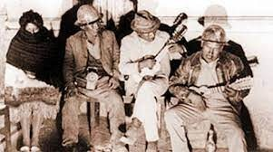

Uno de los primeros libros que me impactó, fue un muestrario fotográfico que realizó la **Asamblea Permanente de Derechos Humanos** sobre la *“Masacre de San Juan”* –pasaje histórico que fue olvidado adrede por algunos *“historiadores”* de los gobiernos neoliberales–que mostraba la matanza en el Centro Minero Siglo XX, centenares de heridos, desaparecidos y muertos por el cruel ataque a la cabeza de la **CIA** y bajo orden desde el Palacio de Gobierno, por René Barrientos, que sus estrategas muy sutilmente se dedicaron a limpiar su imagen y darle el nombre del Tata Barrientos, si les parece conocido, no olvidemos que la dictadora Añez intento lanzarse a la carrera presidencial, su entorno intento limpiar su imagen después de las matanzas del año 2019, con la frase *“Si Fuera Ella - Con Ella”.*

Volviendo a la *“Masacre de San Juan”*, 6 años antes, se llegó a conocer que la **USAID** tuvo un papel fundamental, puesto que intervino en asuntos políticos del país mediante supuestos programas de *“ayuda”*, con míseros 100 mil dólares destinados a la modernización del MNR, a la cabeza de Víctor Paz Estenssoro *(El Mono)*, la Revolución del 52, había claudicado y los dirigentes vendieron la lucha y el proceso del sector minero a los intereses de Estados Unidos. 

La dictadura de Barrientos, tuvo elementos nefastos que atentaban contra los derechos de los trabajadores como son: el **Decreto Ley N° 07171**, que prohibía la militancia activa en organizaciones político-partidistas; obligaba a que todos los sindicatos deban reorganizar sus directivas; y declararon fenecidas las funciones de todos los dirigentes de Sindicatos, Federaciones, Confederaciones y Centrales Obreras de Trabajadores; en la misma idea el **Decreto Ley N° 07172**, obligaba a las asambleas de trabajadores, conformar directivas *ad-hoc*, las cuales deberían contar con la presencia de un personero del Ministerio de Trabajo, fue utilizado como medio de coerción y presión sindical, control de los sindicatos y colocar espías de la dictadura de Barrientos; y el **Decreto Ley N° 07188**, imponía una nueva escala salarial que en la práctica constituyó una reducción del 26,4 por ciento, gran diferencia con lo que ahora aplica el Ministerio de Trabajo en defensa y protección de los derechos de los trabajadores y respeto a la sindicalización.

En 1965, se ratificó el pacto minero-universitario-estudiante, para la defensa de los derechos de los trabajadores, como el fuero sindical; reposición del control de las centrales a los trabajadores; la lucha para la defensa de las principales estaciones de la minería, como el Mutún y la Turqui; la defensa por el petróleo boliviano, ante los mal intereses que ya se había involucrado el *MNR* en su última etapa con la Gulf Oil, o la Standart Oil; nacionalización efectiva de las minas y el petróleo. Al igual que la dictadura de Añez el 2019-20, los dirigentes en aquel momento, también sufrieron persecución judicial y política, las asambleas, las huelgas y los reclamos fueron medios de prueba ante juicios nefastos, colocando bajo rejas a los principales dirigentes.

El 24 de junio de 1967, a las 4:40 am, se inicia el operativo llamado *“Pingüino”*, ataque por tierra y aire contra nuestros trabajadores mineros de *Siglo XX*, con la participación de la II División, el Regimiento Rangers, el Regimiento Camacho de Oruro, el Regimiento 13 de Infantería, la Guardia Nacional, Detectives de Llallagua y la Fuerza Aérea; entre los que resistieron a la toma, fue el dirigente **Rosendo García Maisman**, quien defendió el local sindical hasta caer herido y posteriormente ejecutado. La **COB** fue intervenida y los sindicatos fueron descabezados. Entre los dirigentes asesinados estuvo **Cesar Lora e Isaac Camacho**; así también en plena Masacre de San Juan, el dirigente **Simón Reyes**, llega a salvarse gracias a las personas que estaban en el centro minero, arriesgando su propia vida, como la de Cecilio Soliz. Al igual que esta medida riesgosa, llegue a conocer a compañeros que en el año 2019, lograron sacar a dirigentes, ocultar dirigentes y hermanos de otras nacionalidades que eran perseguidos por la dictadura de Añez.

Un viejo camarada del Partido Comunista que ahora radica en Cochabamba, me relataba que en aquel ataque mortal, los militares ingresaron y dispararon contra las casas de los dirigentes, es de esta forma que hay niños y bebes muertos, porque las balas ingresaron por las ventanas de las casitas, algunos al darse cuenta, colocaron sus camas y colchones como trincheras para protegerse; ese día en la mañana la Radio la Voz del Minero, los colegios y todo espacio social del campamento fue tomado y militarizado. A pesar de aquello, los trabajadores mineros continuaron con el sabotaje a la toma militar, a través de células de resistencia en lo profundo de los socavones.

El rol de los trabajadores de los centros mineros en el año 1967, era de un intenso debate, entre unos que querían llenar las filas del movimiento guerrillero y la lucha armada; y otros que en sus posiciones revisionistas quisieron vender la lucha y nunca hacerle frente a la dictadura.

Existió un voto resolutivo o apoyo a la guerrilla del Che, el 6 de junio se realizó una Asamblea General de los trabajadores mineros de Huanuni, con la presencia de dirigentes de Siglo XX y Catavi, entre sus resoluciones, una que llama la atención es la defensa a la nacionalización de las minas y apoyo moral y materialmente a las guerrillas patrióticas que operan en el sudeste del país, por lo que el Che no se equivocó cuando intentó establecer una lucha armada en situaciones de descontento social, puesto que el descontento llega a ser un factor determinante para cambiar la estructura política de cualquier país. René Zavaleta Mercado, menciona que los mineros de Bolivia, aunque probablemente no estaban con muchas ganas de pronunciar palabras tan mayores y sí en cambio de reponer sus salarios, intentaron sin embargo un titánico esfuerzo de apoyo que la guerrilla nunca les había pedido: fue la matanza de la Noche de San Juan.

De este pasaje histórico, Carlos Soria Galvarro, escribe y saca a luz algo muy importante para nuestra generación, el posible vínculo entre la Guerrilla del Che, con el sector minero. Puesto que, si ese encuentro se hubiera concretado, la Guerrilla no hubiera sido abatida; además que las fuerzas armadas necesitaban un impulso moral, porque en Ñancahuazú las derrotas eran consecutivas.

La implicancia de la empresa en la “Masacre de San Juan”, se realizó cuando cortaron la energía eléctrica, la Radio La Voz del Minero, no pudo alertar sobre el ataque, este corte se llevó a las 5:10, si hubiera existido una alerta, los demás centros hubieran acudido a la defensa. Se realizó un sabotaje de comunicación, con el corte de electricidad, los telégrafos y el transporte, se llevó acabo un bloqueo comunicacional, que es muy frecuente en las dictaduras; lo mismo que ocurrió el año 2019, cuando se cortó las señales de Telesur y RT, impidiendo a los trabajadores de la prensa internacional grabar las masacres y denunciar ante la comunidad internacional.

Es necesario recordar a algunos sacerdotes de la Iglesia Católica, no se quedaron pasivos ante la “Masacre de San Juan”, entre ellos Gregorio Iriarte, menciona entre sus relatos, que el Mayor Pérez, se deslizó al combate, internándose en el campamento La Salvadora, donde se escuchó un tiroteo y el arma de cada solado vomitaba ráfagas de muerte; no tuvieron compasión con la gente que se escondía y que no tenían armas de fuego. Estas palabras son necesarias para realizar una reflexión, ya que el 2019 los principales jerarcas de la Iglesia Católica salieron a defender el Golpe, quedando callados ante las masacres de Senkata, Sacaba y el Pedregal.
 
La matanza en la *“Masacre de San Juan”*, culminó a las 8:00 am, con detenciones ilegales, torturas e interrogatorios a niños, con un saldo de 27 muertos y más de 80 heridos. Ese día y al siguiente, tomaron los campamentos de Catavi, Huanuni y Siglo XX, se hicieron sobrevuelos de la Fuerza Aérea; algo similar al año 2019, cuando vimos aviones de la Fuerza Área sobrevolar la ciudad de La Paz y El Alto, está clase de operaciones, tienen la finalidad de provocar miedo y amedrentamiento a los ciudadanos.
 
La dictadura de Barrientos obligó a las empresas que despidan a sus trabajadores, varios de ellos resultaron en las calles, las radios destruidas y ocupadas. Para esto la dictadura tenía una lista negra, de la cual descabezaban a los principales dirigentes y los *“hostigadores”* del gobierno de facto. La historia se repite, la dictadora Añez y sus principales ministros como Murillo y Marinković, ingresaron con una lista negra, todos aquellos que eran y fueron parte del **MAS**, fueron despedidos, algunos procesados y denunciados como terroristas. La famosa lista negra al estilo de la época nazi. 

Al final las dictaduras tienen los mismos medios de terror y amedrentamiento, la toma del poder es el objetivo principal, para satisfacer sus necesidades personales y destruir la base trabajadora, campesina, indígena, universitaria, etc., La historia se repite, lo único que cambian son los personajes, por lo que ahora la lucha es necesaria y la organización tiene que ser el rumbo de nuestro proceso, al final esta generación de la que soy parte y que ya estamos de pasada, reiteramos e intentamos que nuestras nuevas generaciones no olviden.
Por: 

**Galo Amusquivar** 

