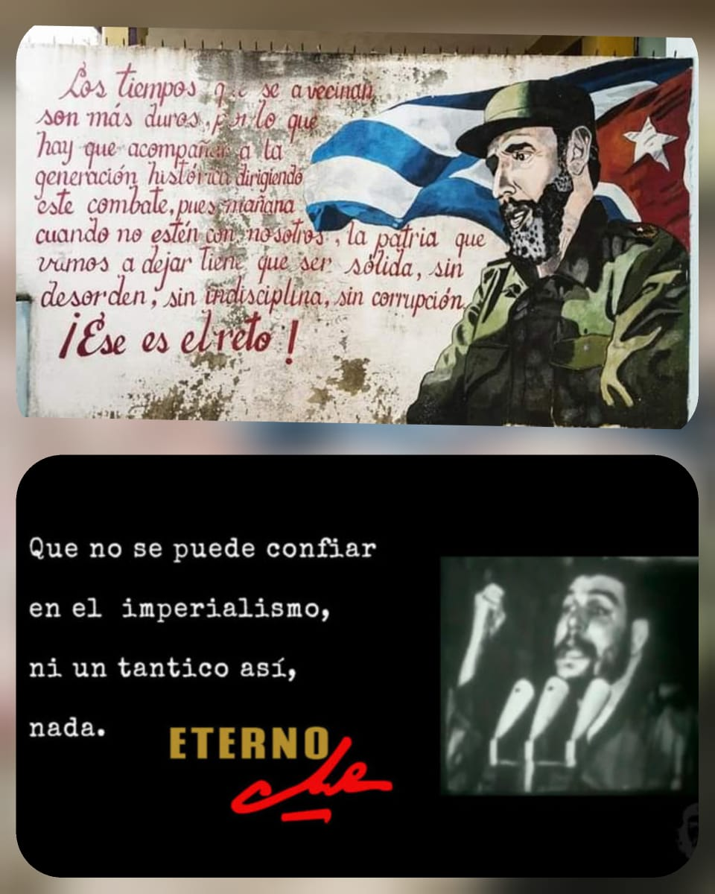

El Comandante Fidel dijo: **«Los tiempos que se avecinan son más duros, por lo que hay que acompañar a la generación histórica dirigiendo este combate, pues mañana cuando no estén con nosotros, la patria que vamos a dejar tiene que ser sólida, sin desorden, sin indisciplinas, sin corrupción. ¡Ese es el reto!»**

Al ganar la elección del pasado 18 de octubre con más del 50% aparece un reto a los compañeros [#LuchoArce](#LuchoArce) y [#DavidChoquehuanca](#DavidChoquehuanca), que al ser parte de esa generación histórica que a partir del 2005 lograron colocar en altos estandares el nombre del Estado Plurinacional de Bolivia en las áreas de la Economía y la Diplomacia Internacional, para dicha labor ambos candidatos ya victoriosos manifestaron que conformarán un equipo de jóvenes cuadros tanto en lo político y técnico para recuperar la patria y volver a colocarla en los más altos estandares de la región y el mundo.

Lo que decía Fidel tiene mucha importancia y vigencia, después de que destruyeron en 11 meses la patria, es una labor titánica la que se viene pero no puede ir alejada de la "vieja guardia" que con su ejemplo de resistencia y ética siempre ejercieron ese faro guía para poder alcanzar lo que se consguio el domingo. 

Al conversar con compañeras y compañeros de la denominada "vieja guardia" manifestaban 2 visiones y preocupaciones que deseaban plantearla a nuestros candidatos ganadores: 

  1. Que acciones van a hacer y sobretodo que acciones podemos hacer para consolidar el proceso de cambio y cumplir el programa de gobierno.

  2. Que hay que hacer para evitar que vuelva a ocurrir un [#GolpeDeEstadoEnBolivia](#GolpeDeEstadoEnBolivia) como sucedió en el 2019.

Debo resaltar que en el punto 1 los compañeros no solo exigen, sino que desde sus posiciones evalúan como pueden aportar.

Sobre lo segundo se debe determinar el rol de formacion (no únicamente a nivel académico sino también político) he ahí una de las grandes fallas que existe a nivel de centros de estudio (colegios, escuelas técnicas, universidades) y tambien a nivel global, en sindicatos obreros, sindicatos campesinos, OTB, FEJUVES, centros culturales y artísticos, asociaciones gremiales, asociaciones de profesionales (médicos, ingenieros etc), alcaldías, gobernaciones, en si todo lugar que logre aglomerar personas con determinado fin, porque si algo nos ha enseñado la [#DictaduraEnBolivia](#DictaduraEnBolivia) es que TODO ES POLITICO y que si no tomas posición en cuanto a determinados asuntos como :salud (pandemia, corrupción, médicos sin equipos de bioseguridad), medioambiente (transgénico, incendios), economía (posible devaluación de la moneda, créditos a fondo perdido a empresarios, etc), cultura (cierre de ministerio, recursos de PIU destinados a restaurar iglesias), deporte (cierre de ministerio, eliminación de juegos plurinacionales), educación (despidos masivos, clausura del año escolar), persecusion política y gastos absurdos (gastos en aviones para misses, fiestas, gastos y corrupción en compra de armamento para policía y militares, apoyo a grupos paramilitares racistas) ... nuevamente recordar ... si no tomas posición en cuanto a esos asuntos el resultado es crisis económica y un PIB negativo con presos políticos, racismo y sobretodo mucha corrupcion, he ahí la importancia de la formación política constante de toda la sociedad: artistas, comerciantes, obreros, campesinos, deportistas, servidores públicos, estudiantes universitarios, colegiales, docentes universitarios, profesores, médicos, enfermeras, activistas ambientales, en si TODOS, porque absolutamente todos estos actores fueron y fuimos afectados por las pesimas decisiones políticas llevadas adelante por la derecha. Además debemos hacer un llamado de atención importante a las organizaciones sociales y al Instrumento (MAS) porque es una responsabilidad conjunta la ausencia de formación, a esta altura no deberíamos tener solo 2 líderes indígenas jóvenes alteños y chapareños, deberíamos tener miles y la labor de los movimientos sociales además de la re invindicacion social y de petitorios sectoriales debe ser la formación de nuevos líderes con valores y ética con conciencia social.

El segundo aspecto a trabajar es el rol de los medios de comunicación, antes de la Victoria existía una actitud agresiva hacia el [#MAS](#DictaduraEnBolivia) y nuestros candidatos, luego se dio un cambio abrupto, ¿ el motivo? ; pues la mayor cantidad de ingresos económicos a los medios de comunicación proviene de la publicidad estatal, en pocas,se venden al mejor postor, pero en su ámbito de supuesta imparcialidad, proceden mediante supuestos "espacios pagados", entrevistas a "analistas" pretenden desacreditar a la opción popular y sobretodo a la izquierda. Es de conocimiento general que los grandes medios, no solo se dedican a ese rubro, están en otros emprendimientos económicos, en los cuales fueron afectados sus ingresos económicos por políticas sociales como ser la inamovilidad laboral en caso de maternidad y paternidad, subsidios, incrementos salariales, doble aguinaldo y empresas sociales; por tanto reciben dinero del estado en publicidad con una mano, pero meten el cuchillo con otra.

Ahi debemos tomar conciencia que gracias a estos medios y la amplificación en el imaginario colectivo del supuesto "fraude", supuesta "lucha por la democracia","expulsar al tirano", "indolencia por los incendios en el año 2019" y ademas de la sarta de personajes de farándula promoviendo dicho discurso en medios de comunicación y redes sociales, el #GolpeDeEstadoEnBolivia no hubiera sido exitoso.

Durante varios años se convivió con estos enemigos por temor a que simplifiquen un discurso de que NO HAY LIBERTAD DE EXPRESION, pero igual lo hicieron, lo irónico en todo esto es que la #DictaduraEnBolivia si saco un decreto que si cortaba la libertad de expresión,amparados en desinformación de la pandemia (que en realidad fue para ocultar la corrupción con respiradores y cuantas cosas más), esa convivencia con el enemigo y concesiones (como ampliar licencias de funcionamiento a cambio de publicar logros sociales fue inutil) esa convivencia trajo una élite en medios de comunicación privados, por tanto la misión ahora debe ser, si bien no proscribir estos medios de comunicación, es la necesidad de crear y tener mayor participación en estos espacios,con mas canales estatales, radios comunitarias, promover que cada ministerio tenga su radio o canal informativo etc. 

Después del golpe y declaraciones de ex trabajadores de Facebook a los cuales les ordenaron apoyar a #CarlosMesa el año pasado, se confirma y aunque lo nieguen, que el IMPERIALISMO existe,es real, vimos como actuo Facebook,como se desplomó las acciones de Tesla de [#ElonMusk](#ElonMusk) después de las elecciones y sobretodo como fungió la OEA en avalar un [#GolpeDeEstado](#GolpeDeEstado) y de como fuimos tan ingenuos en otorgar confianza a un organismo que atacó tan ferozmente a [#Cuba](#Cuba) y [#Venezuela](#Venezuela).

Y recuerden como diría el #Comandante Ernesto Guevara:

**"...porque es la naturaleza del imperialismo la que bestializa a los hombres, la que la convierte en fieras sedientas de sangre, que están dispuestas a degollar, asesinar, a destruir hasta la última imagen de un revolucionario, de un partidario de un régimen que haya caído bajo su bota o que luche por su libertad... Y recordemos siempre, que no se puede confiar en el imperialismo pero ni tantito así, nada.”**

No cometamos los mismos errores, estamos del lado correcto de la historia, nuestro deber es eliminar el fascismo.

Esto no podría ser posible sin el ejemplo y acompañamiento de la vieja guardia, en estas horas de lucha siempre recuerdo a Fernando Campero, su ejemplo y temple y también recuerdo a otros grandes compañeros de los cuales aprendí mucho y espero que cada uno de ustedes desde sus trincheras apoyen a consolidar un mundo más justo basado en el ejemplo de estos compañeros.

Hasta la victoria compañeras y compañeros.

Atte.

Gabriel Campero Nava[^1]

[^1]: no mencione las barbaridades a nivel de relaciones internacionales, pero todos las sabemos.