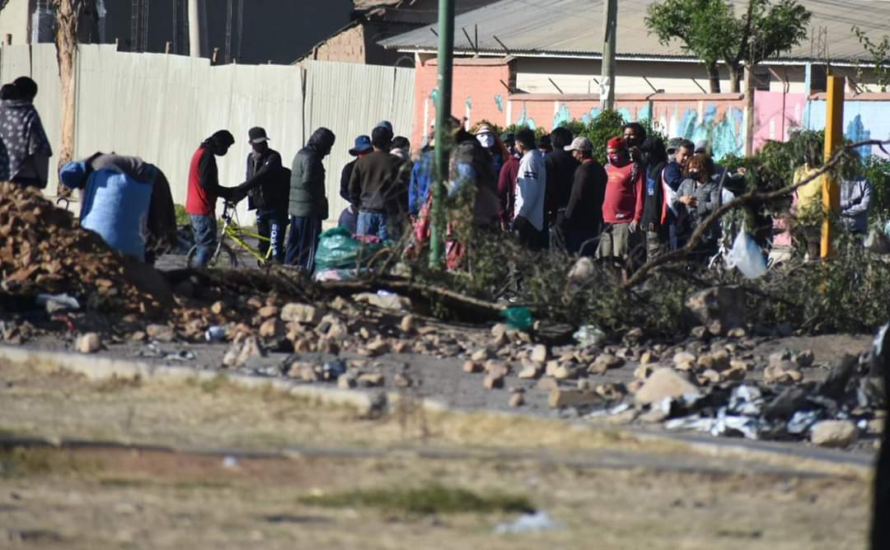

--- 
title: Represión en Kara Kara, crisis sanitaria y humanitaria en Bolivia
subtitle: Gobierno de facto
author: 
date: '2020-07-04'
slug: represion-en-kara-kara
categories:
  - articulos
tags: []
authors: 
- Anibal_Urquieta
doi: ''
publishDate: ''
publication_types:
  - '0'
publication: ''
publication_short: ''
abstract: ''
summary: ''
featured: yes
url_pdf: ~
url_code: ~
url_dataset: ~
url_poster: ~
url_project: ~
url_slides: ~
url_source: ~
url_video: ~
image:
  caption: ''
  focal_point: ''
  preview_only: no
projects: []
slides: ''
---

La mañana de este sábado 4 de julio de 2020, la brutalidad de la violencia fascista y racista del gobierno de facto, se volvió a enseñar con la gente más humilde de la zona sur de [#Cochabamba](), específicamente de [#KaraKara](), colindante con el botadero municipal de esta ciudad. 

Una violenta y desmedida represión de un contingente de policías y militares, apoyados por el sobrevuelo de aviones de combate y helicópteros, armados como si estuvieran yendo a recuperar el mar, fue la respuesta a hombres y mujeres diezmados por la pandemia del coronavirus y el hambre. Recordemos que los pobladores de Kara Kara están en emergencia hace semanas atrás pidiendo, entre otras cosas: la libertad de 3 detenidos que fueron trasladados a La Paz; condiciones de trabajo para poder subsistir junto a sus familias; reactivación del proyecto del Tren Metropolitano, que iba a traer empleo directo e indirecto a miles de familias; cumplimiento de la subvención del pago de facturas de luz mientras dure la cuarentena; pago de las deudas a los bancos hasta 6 meses después de concluida la cuarentena; conformación de brigadas vecinales para repartir, de forma gratuita, medicina natural a los pobladores para que puedan combatir el COVID-19 ante la total desatención de las autoridades nacionales y municipales, entre otros justos pedidos. 

Esta violenta represión, se da además en el marco de un panorama que empieza a ser desolador y que amenaza aún más en convertirse en un nuevo foco de infección en la ciudad de Cochabamba, por la cantidad de cadáveres de personas que fallecen en sus domicilios y que no pueden ser enterrados por sus seres queridos en el cementerio general, permaneciendo hasta el momento muchos de ellos entre 5 y 7 días incepultos. 

Esta dramática situación, que lejos de recibir una solución de parte del Alcalde [#JoséMaríaLeyes](), quien además es correligionario político de [#JeanineAñez](), y que al más puro estilo de [#CarlosMesa]() ya renunció hace unas semanas a su cargo, para luego retroceder, no recibe ni de Leyes ni de Añez ningún tipo de solución, siendo la única respuesta a sus clamorosos y urgentes pedidos hasta ahora, la represión, la persecución, el amedrentamiento y el sobrevuelo de aviones y helicópteros.

El pueblo cochabambino y el pueblo boliviano en general, ya no aguantan más la precariedad, la ineficiencia y la indolencia de quienes están obligados a darle al país respuestas y atención a sus demandas. El alcalde Leyes y la señora Añez, deben darle respuestas inmediatas a la población, mejorando la atención a los infectados por el coronavirus, solucionando el colapso por la acumulación de cadáveres en domicilios particulares y dando condiciones de trabajo y alimentación a la población más vulnerable.

Ante esta insostenible y alarmante realidad, el pueblo seguirá haciendo frente con las únicas armas con las que cuenta, la solidaridad y su profunda vocación democrática, la misma que se traducirá en las urnas, el próximo 6 de septiembre, en una contundente reafirmación por el retorno a la democracia y a la estabilidad económica, política y social que todas las bolivianas y los bolivianos gozábamos durante los últimos 14 años.