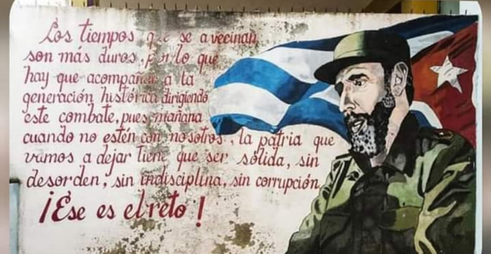

Mi papá, Fernando Campero Marañón siempre resaltaba la forma de cómo se estableció el poder popular en el Estado Plurinacional de Bolivia desde el 2006, señalando la diferencia con otros procesos, en otros casos  la toma del poder por las clases oprimidas surge de movimientos armados o revoluciones armadas a diferencia del proceso de cambio en nuestro país, él señalaba que nuestra revolución es democrática y como tal hay que entender que los mecanismos de cambios estructurales son diferentes, más lentos.

Lo otro, es algo que personalmente en estos 11 meses de [#DictaduraEnBolivia](#DictaduraEnBolivia) aprendi y creo que todos aprendimos:" Es más fácil destruir que crear" en 11 meses destrozaron lo que en 14 años nos costó levantar, partiendo de nuestra dignidad, raíces culturales terminando en nuestra economía nacional.

Después de esa breve introducción comienzo el presente analisis, sobretodo de lo acontecido en estas 3 semanas de gobierno que llevan el compañero [#LuchoArce](#LuchoArce) y [#DavidChoquehuanca](#DavidChoquehuanca).

Las desarticulación de la redes de corrupción y oportunismo pititas instaladas en el aparato estatal no se realizará de la noche a la mañana, debe existir mecanismos fidedignos de verificación de la condición de fascista- pitita, puesto que caso contrario empezamos con una cacería de brujas que sentencia a solo nombramiento a cualquier persona ( persona que se mantuvo trabajando en el aparato estatal o no al darse el golpe, pero que puede o no que haya sido fascista de closet, traidor, pirita o simplemente un ser humano cualquiera que debía llevar el pan de cada día a su casa y que por eso no renuncio ) y ademas jamás olvidarnos que sin algunos de esos buenos compañeros fieles al Proceso de Cambio jamás se hubiera detectado la corrupción del [#GobiernoDeFacto](#GobiernoDeFacto) de [#AñezAsesina](#AñezAsesina) como en los casos de [#respiradores](#respiradores), [#gaseslacrimogenos](#gaseslacrimogenos), [#entel](#entel), [#ypfb](#ypfb) etc. Por tanto exigir por simple publicación en [#RRSS](#RRSS) desvinculación a cualquier persona puede costarnos caro, podríamos estar perdiendo a grandes compañeros leales, ya que incluso los mismos oportunistas pititas están haciendo correr información para generar malestar en nuestras filas, con la finalidad de desgastarnos antes de las elecciones subnacionales (recordemos, el imperialismo no descansa, mientras nosotros construimos la patria, ellos están organizándose para las elecciones o planeando otro golpe).

La orientación de responsabilidades en los casos de asesinatos, torturas de Senkata Sacaba, de liberación de presos políticos y también de sanciones, procesos apresamiento a los grupos paramilitares que apoyaron a la [#DictaduraEnBolivia](#DictaduraEnBolivia). A partir de que el compañero [#LuchoArce](#LuchoArce) y [#DavidChoquehuanca](#DavidChoquehuanca) asumen el gobierno se ha estado exigiendo al Órgano Ejecutivo la liberacion de presos políticos con sentencia y sanción a los responsables intelectuales y materiales de lo acaecido en Senkata y Sacaba así como encarcelamiento de los grupos paramilitares que apoyaron el golpe, cuando estas acciones deberían exigirse al ORGANO JUDICIAL (independiente del ejecutivo), esta situación clarifica 2 hechos: 

Que [#Añez](#Añez) era una [#Dictadora](#Dictadora) puesto en menos de lo que se espero libero a delincuentes con procesos y sentencias inobjetables como ser Leopoldo Fernandez y José María Leyes uno por el caso porvenir y otro por caso corrupcion mochilas. Estas acciones pasan por encima del Organo Judicial, lo cual implícitamente señala que hay una sola cabeza autoritaria con poder de liberar a delincuentes. Y por ende descalifica la narrativa que el Gobierno del MAS era una Dictadura ya que si así fuera hubiéramos apresado inmediatamente a gente como Carlos Valverde, Camacho Albarracin etc basándonos en Sedicion así como lo hicieron ellos con compañeros de base inocentes como ser Los del caso de la Agetic y Brigada Medica Cubana.

Lucho Arce es un presidente electo en las urnas, respetuoso del orden establecido y no esta haciendo injerencia en un órgano independiente, pero él es nuestro principal vocero que EXIGE JUSTICIA para todas las víctimas de la Dictadura y que a su vez ha instruido se inicien las investigaciones para comprobar, llevar a juicio, procesar y sancionar a los grupos paramilitares y a quienes los financiaron durante la [#DictaduraEnBolivia](#DictaduraEnBolivia).

Empiezo a ver a varios compañeros desanimados al ver las demoras en estos casos mencionados anteriormente, pero es bueno recordarles, nosotros no somos dictadores como Añez, fuimos DEMOCRÁTICAMENTE electos con el 55% y nuestra labor no es ejercer venganza sino JUSTICIA enmarcada en el respeto de la norma, lo que no deja de lado que cumplamos con nuestro rol de control social, HAY QUE EXIGIR AL ORGANO JUDICIAL la liberación de presos, sanciones a los autores de las masacres de Senkata y Sacaba y cárcel a los grupos paramilitares. 

El control social no debe hacerse únicamente al Ejecutivo, debemos presionar al Organo Judicial, para que nunca más se "legalice" el apresamiento político, tortura, se libere al asesino y se permita la creación de grupos irregulares.

Somos una Revolución Democrática, NO UNA REVOLUCION ARMADA para cambiar todo de un plumazo y en nuestra revolución llevara tiempo reconstruir la Patria ya que como al inicio señale, es más fácil destruir que crear y debemos trabajar mucho y en 3 semanas no se realizará esa tarea TITÁNICA y siempre recuerden al comandante eterno [#FidelCastro](#FidelCastro):

"Los tiempos que se avecinan son más duros, por lo que hay que acompañar a la generación histórica dirigiendo este combate, pues mañana cuando no estén con nosotros, la patria que vamos a dejar tiene que ser sólida, sin desorden, sin indisciplinas, sin corrupción. ¡Ese es el reto!"

