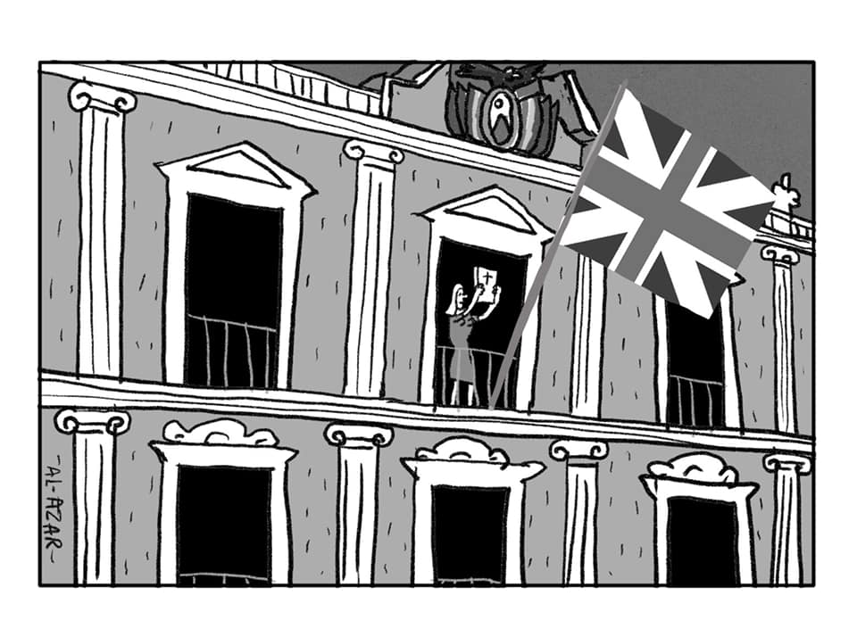
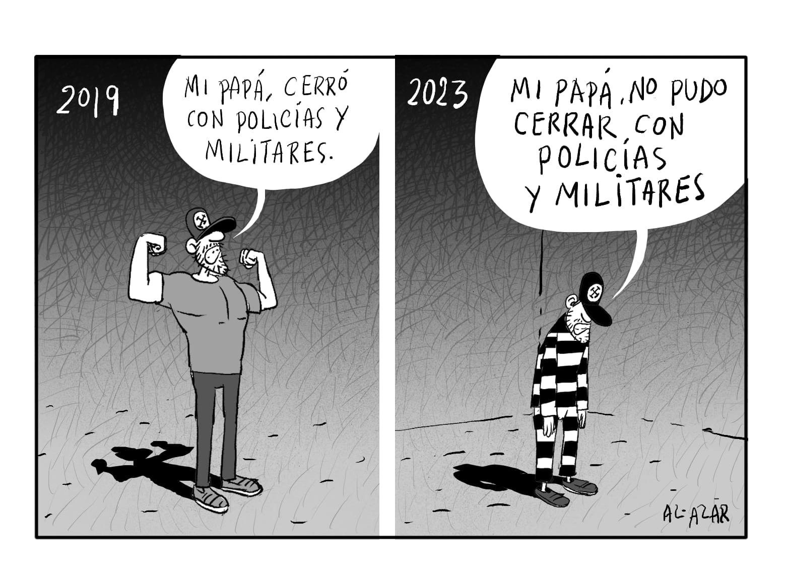

"Los fascistas del futuro no van a tener aquel estereotipo de Hitler o de Mussolini. No van a tener aquel gesto de duro militar. Van a ser hombres hablando de todo aquello que la mayoría quiere oír. Sobre bondad, familia, buenas costumbres, religión y ética. En esa hora va a surgir el nuevo demonio, y tan pocos van a percibir que la historia se está repitiendo." Esta frase algunos la atribuyen a Saramago y otros la desmiente, lo que si es verdad que es muy vigente y esta trascendiendo a todos los lugares en los cuales los bloques progresistas están ganando espacios y lógicamente los rostros del fascismo irán asumiendo posturas y posiciones como las que señalaban previamente.

En el año 2019 entraron con la Biblia al palacio después que desde el año 2009 se aprobara una constitución que ya reconocía a esa población excluida, olvidada, que estaba siempre a la vista de que únicamente podrían ser el “q’epiri , la empleada doméstica” pero jamás un Ministro , o director de alguna entidad estatal. Esa dinámica de fascismo que en su momento se opuso a esa nueva constitución, fue la que “entro con la biblia al palacio” trayendo en teoría consigo “valores  familiares, buenas costumbres “ y esa clase media  desclasada, se comió el cuento que decían sobre eso “valores” o peor aún, no lo creyó y no hizo nada, porque su condición de clase, hacia que pensaras como vives y en 14 años de proceso de cambio , sin formación política , sin una educación descolonizada (como cambio en la malla curricular, que ahora se esta impulsando) medidas culturales para empoderar el Proceso de cambio, y sin medios de comunicación que respondan a los cambios en favor de las mayorías ,  fue muy fácil para que estos nuevos fascistas regresen al “palacio” ,dejando de lado esa “casa grande del pueblo”.

Hoy debemos analizar qué hay detrás de cada discurso, detrás de cada consigna , muchas de ella usadas por personas de derecha coinciden con lo que impulsaba e impulsa  la izquierda, como el “ambientalismo” que ya en el año 93 el Castro- Comunismo ya lo mencionaba , pero vemos como Senadoras de Comunidad ciudadana, el día de hoy , se adueñan de campañas nobles, desviando el horizonte equitativo del discurso convirtiéndolo en político de desmedro al gobierno de turno,  sin tener presente otros factores, ya que como dijimos antes “piensas desde la condición de clase que tienes” , otro aspecto que se aborda mucho en estos nuevos rostros del fascismo esta el uso desmedido de la religión , que tan lejos esta actualmente de la teología de la liberación que impulsaban otrora grande académicos de la iglesia católica, que tristemente hoy, sobre todo en nuestro país se han convertido en voceros defensores de asesinos y corruptos.

Debe verse como estos falsos” profetas” de consignas nobles no consigan “devotos” incautos que desvíen el horizonte inicial de estas campañas que no contradicen la lucha de la izquierda, pero que sin un objetivo de justicia social son simplemente campañas vacías, ya que priorizaremos lo externo antes que al ser humano y sobre todo al ser humano humilde.

Es deber de la izquierda que esta en esta nueva ola progresista, asuma estas banderas con responsabilidad teniendo presente siempre al ser humano como  actor principal, no podemos hablar de medio ambiente sin su primer elemento “felicidad humana” , no podemos hablar de los pobres , cuando como iglesia estoy ganando millones y defendiendo a corruptos afirmando que “no hubo golpe” , por tanto ,no podemos como militantes de izquierda desviarnos del objetivo histórico planteado con el proceso de cambio, perdiendo día a día simpatizantes de nuestro proceso, porque unos cuantos “pajpakus” son más mediáticos. Incluyamos a estas personas, pero con un horizonte al socialismo, para que los nuevos rostros del fascismo no ganen terreno.

Adolfo Mena Gonzales

