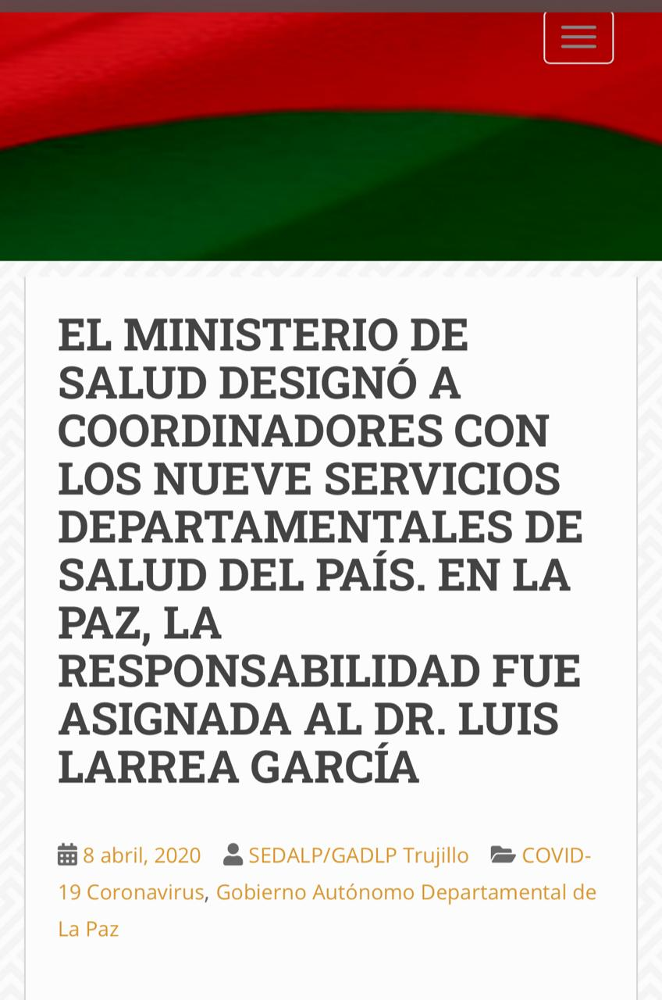

La antigua dirigencia del FESIRMES, cuando el dialogo no fluía con las autoridades del Ministerio de Salud, optaba por poner sobre la mesa de negociaciones, como carta final, la amenaza de “sacar a su perro”.

No necesariamente en salud, se puede hablar de diálogos sinceros, y es porque los cálculos que hace la dirigencia médica, tienen que ver casi siempre, con el rédito que se obtiene por la suspensión de la atención en centros de salud y hospitales. 
No es novedad entonces, la oposición secante al Proyecto de Ley de Emergencia Sanitaria y justamente ésta, desnuda los verdaderos intereses, que tiene el Colegio Médico de Bolivia. 

Se oponen al Artículo 17 de este Proyecto de Ley, que permitiría la regulación de los precios de internación y tratamientos médicos, durante la vigencia de la declaratoria de emergencia sanitaria. Evidentemente se habla de dinero y cuando a esta dirigencia le afectan el bolsillo, le cobran esa factura al pueblo.

Quien ha tenido que acudir a Clínicas Privadas, en busca de atención médica, sabe muy bien lo costoso que es la internación, los medicamentos y la atención especialista. En época de pandemia, este costo se incrementa superlativamente, y llega a extremos, donde si usted quiere ser atendido o ingresar a alguien por el tema del COVID-19, le exigen un depósito previo, entre 2000 a 5000 dólares, eximiéndose de la devolución del mismo en caso de fallecimiento. Será por esto mismo que el proyectista, ha previsto en favor de la población, un candado que impida el negociado del subsector privado de la salud. 

Asimismo, están en contra del Artículo 19 del mencionado Proyecto de Ley, que dispone que mientras exista una declaratoria de emergencia sanitaria, durante la misma, no podrán ser interrumpidos los servicios del Sistema Nacional de Salud, por paros, protestas o huelgas, o por jornadas académicas y/o similares. 

Al respecto, deberá aclararse que los paros, protestas o huelgas con suspensión de actividades, deben ser declarados legales por el Ministerio de Trabajo, como consecuencia de la fallida negociación entre empleado y empleador, debiendo agotarse el camino del diálogo, que si este resulta infructuoso, deberá concluir recién en esta medida de presión. Bien, como esta premisa nunca es cumplida por este sector, siempre fue declarada de ilegal sus medidas de presión, porque prevalecen siempre los derechos fundamentales, como el de la salud y la vida, frente a los derechos colectivos de segunda generación.

Como solía hacerse antes, declaradas ilegales las huelgas realizadas, se procedía con la sanción administrativa correspondiente, descuentos por inasistencia laboral. Las bases, sustento de cualquier dirigencia, reclamaban a sus representantes lo sucedido, y éstos al encontrarse cuestionados, recurrieron al subterfugio, de declararse en “jornadas académicas” con suspensión de actividades, en el intento de no ser declaradas nuevamente como ilegales sus huelgas.

También es conocido, que ante cualquier suspensión laboral, llámese como se llame, en los comunicados dirigidos a las bases, se inscribían señalamientos que pretenden, esquivar responsabilidades, como el reforzamiento a las unidades de emergencias de los distintos nosocomios, es decir, que hacían creer que no se habían cometido abandono de sus fuentes laborales, sino que se habían replegado a emergencias y nunca suspendieron la atención. Por supuesto, el pueblo nuevamente pagaba estas jugarretas.

Finalmente, se oponen al Artículo 28 del Proyecto de Ley, que dispone la previsión de simplificar los requisitos para el ejercicio en el país, de los médicos (generales y especialistas), personal de enfermería y técnicos en salud, de aquellos que hubieran concluido sus estudios en el exterior. 

Las alarmas se activaron, pero no por la amenaza de competir por puestos laborales con otros profesionales, indistintamente del país de formación. Más concretamente, debe decirse que existe un trauma, encubierto por un chauvinismo propio de los que sienten afectados sus intereses. El año pasado, durante el gobierno no constitucional de Añez, se expulsó del país a médicos cubanos, pertenecientes a la Brigada Médica Cubana, cuyo actuar se encuentra reconocido en muchos países del mundo. En Bolivia, principalmente ingresó a ser parte de la atención de los sectores más alejados del país. Muchos Alcaldes y Alcaldesas, cuyo territorio es rechazado por los mismos profesionales en salud, porque no quieren ir a lugares remotos y poco accesibles, allí hacen presencia los Médicos del Programa Mi Salud, los especialistas SAFCI y la Brigada Médica Cubana. Muchos alcaldes afirmaron, que el ofrecimiento de contratos o ítems a médicos generales y especialistas, además del sueldo, venía con la otorgación de vivienda y transporte, en la posibilidad económica de cada municipio, sin embargo, la respuesta la mayor de las veces, era un rotundo no.

Bien, para que un médico ejerza en el país, debe contar con título en provisión nacional, y matrícula profesional. La matrícula la emite el Ministerio de Salud, previa revisión del título. Sin embargo, sucede que las Universidad Públicas, monopolizaban la homologación títulos extranjeros. A partir de que el Ministerio de Educación es competente, de realizar esta tarea, tras el surgimiento de Universidades Privadas, y ahora del extranjero, los intereses económicos de las públicas, en concomitancia con el Colegio Médico de Bolivia, en el que por supuesto tienen integrantes a los Docentes y Decanos de las Facultades de las carreras de salud (por esa razón el chantaje por puntos a sus estudiantes, logra grandes participaciones en las protestas), le han declarado una guerra sistemática, no solo al extranjero que quiere trabajar en Bolivia, sino al mismo compatriota que por distinta razón fue a estudiar a otro país y quiere ejercer en su patria, su vocación médica.

Hablando de especialistas en salud, el mundo entero está viviendo una crisis de ellos, por lo costoso que resulta la formación. En nuestro país, los especialistas que llegan, no son reconocidos como tales, sin que antes hayan pasado por dos requisitos básicos, ser miembros activos del colegio médico y estar reconocidos por su sociedad científica, esta última es una instancia en la que sus pares especialistas, analizan si ha sido “bien formados”. Es decir, si ellos consideran que para cierta especialidad, el médico debió haber estudiado 5 años, porque en Bolivia se estudia esa cantidad de años, distinto del país donde existió un avance en las necesidades de formación, donde ha disminuido 1 año, para la sociedad científica correspondiente, el médico debe hacer 1 o 2 años más de formación “complementaria”, para ejercer su especialidad. Resultado de esto, la migración sistemática de especialistas bolivianos formados, a otros países. 

Aun hay más. El problema del sueldo del especialista. La Escala Salarial vigente, establece que los médicos generales, en el sector público deben recibir un haber básico de Bs.-8636, mensuales. Pero para un especialista, existe la instancia de “Categoría Profesional”, que establece que el especialista, debe recibir el doble de ese monto: Bs.-17.272. Ya parece una cantidad razonable para un especialista, sin embargo para que el especialista pueda calificar a la “Categoría Profesional”, debe Institucionalizarse. Si, un paso previo. La Institucionalización no significa otra cosa, que el médico, haya ganado un concurso de méritos y examen de competencia, ante un tribunal, compuesto por representantes de Ministerio de Salud y Deportes, Sociedad Científica correspondiente, el Colegio Médico Departamental y Nacional. Volviendo de esta manera, a que si el medico especialista no es miembro de este colegiado, no podrá institucionalizarse y mucho menos categorizarse, nunca podrá mejorar su situación laboral. Nuevamente, fuga de especialistas.

Mas allá de emitir cualquier comentario al convenio suscrito entre el Colegio Médico de Bolivia y el Ministerio de Salud y Deportes. Habrá que analizar el momento y la situación que vive nuestro país.
Había empezado el presente artículo, recordando la amenaza que realizaba la dirigencia médica, ante la imposibilidad de conseguir el cumplimiento de sus demandas por la vía del diálogo. El personaje animalizado por sus colegas, no es otro que Luis Larrea. Nótese que no antepongo la abreviatura de doctor delante de su nombre, pues la profesión, el ejercicio de la misma, antecede al nombramiento del  título, y a falta del ejercicio de la medicina por este individuo, de doctor no tiene nada. 

La antigua dirigencia sabía muy bien, que a Larrea le encanta la cámara, sabía muy bien que no tiene reparo alguno para utilizar, ese lenguaje vulgar para atacar a las autoridades, y que le hace un favor enorme a la prensa amarillista, al ser como es.
No hay secreto que no se sepa de él, se sabe que ejerce el racismo hacia los indígenas, y hace burla de la medicina tradicional, a pesar que da clases en la universidad de esa misma materia. 

No hay que olvidar que el 2020, en el gobierno de Añez, fue designado como Viceministro de Salud, los documentos existen, pese a que haya salido varias veces a negarse haber sido tal. Poco tiempo después, el Ministerio de Salud, generó procesos de contratación directa, para personal en salud en todo el país. El representante político en La Paz, era Larrea nombrado coordinador. Si usted es del sector salud y quería trabajar, pero no pertenecía al gremio de esta persona, no tenía cupo. Al contrario al tener esta potestad, se dice que reunió bastantes recursos económicos, para su actual campaña política para ser Alcalde de la ciudad de La Paz, deberá investigarse ello.   
Ha salido nuevamente a la palestra pública Luis Larrea, parece que nuevamente le soltaron la cadena.

Ariel Percy Molina Pimentel “**El Molinario**” 
Abogado y Militante MAS – **IPSP** 
Miembro Colectivo **“*La Vanguardia*”**
