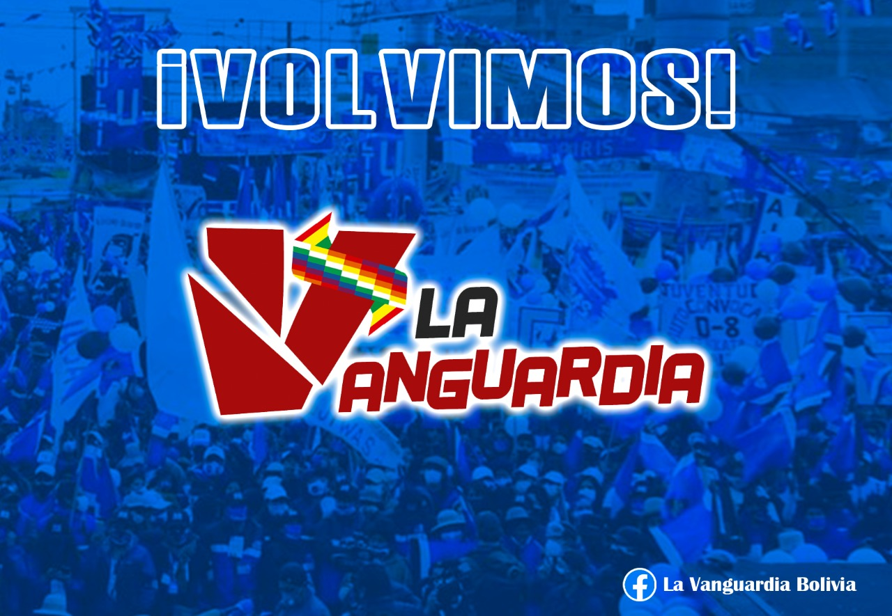

La anterior semana después del golpe del año 2019 se sufrió un ataque de carácter masivo en las redes de izquierda que se usan en territorio boliviano, este ataque o mecanismo de censura todavía no tiene responsables identificados, pero la mayoría atribuyen que esto se dio a razón de que las paginas de izquierda estaban denunciando todo lo suscitado en cuanto a violación de derechos humanos en Perú, los asesinatos, la violencia estatal impuesta por el gobierno que derroco a Pedro Castillo.

Esta situación da nuevamente una visión muy clara sobre el poder y la hegemonía que tienen lo dueños de estas plataformas de redes sociales, quienes que con un simple “*click*” pueden callar las voces de diferentes personas, otorgando un cerco mediático a nivel mundial sobre lo que está pasando en el hermano país.

Nuestro país sigue siendo novel en cuanto a manejo de redes sociales y comunicación digital, tristemente vivimos esta experiencia desde el año 2016 cuando a raíz de rumores e información falsa se atribuyó un inexistente hijo a nuestro ex presidente, lo cual desencadeno una serie de ataques en medios digitales y por ende en una derrota en el referéndum del 2016, del cual, el responsable de difundir aquella falacia, sigue campante e incluso fue nombrado periodista del año. Antes y después de la derrota del referéndum nos llamaron a varios activistas de RRSS, para evaluar como contrarrestar mediáticamente esto, se sugirió muchas veces pago de publicidad de contenidos en RRSS (que en aquel momento era mucho más fácil que en la actualidad, sin tener que exponer el nombre completo del usuario que paga por publicidad) y también se decide crear (*de forma tardía*) la dirección de redes sociales. Con un buen o mal manejo (*eso lo definirá cada persona y también tener presente que era un área desconocida en aquel momento*); con todo(*errores y virtudes*) se lanzó esa dirección con un horizonte de posicionar gestión de gobierno y logros del proceso, esperando que la interacción sea satisfactoria, pero lamentablemente estas plataformas, son mas propensas al morbo y el odio, por tanto diríamos que pese a que se trabajo arduamente en esta área, poco a nada influyó, ya que todos los logros (*que no son pocos en 14 años*) valieron casi nada en el golpe del 2019, imperando posverdad en muchos usuarios que expresaron su odio visceral en contra de la democracia y apoyando el derrocamiento del compañero Evo Morales en el 2019 y silenciando las denuncias de asesinatos en Senkata y Sacaba en varias redes como se dio hace una semana en varias plataformas de izquierda en Bolivia.

El suceso que se dio la anterior semana, fue una seria llamada de atención a la necesidad de crear nuevas plataformas de trabajo (*algo difícil, pero necesario*) ya que la soberanía también debe,ser tecnológica y con fuerte incidencia en medios digitales, en la cual se ha tenido un avance fuerte a nivel de servicios digitales gubernamentales, pero poco o nada en cuanto en medios de comunicación, es así que vemos experiencias muy interesantes como lo son China, Rusia quienes tienen sus propias plataformas de información y comunicación. 

En nombre de la libertad de expresión se han hecho barbaridades en nuestro país, es necesario tener un control, complementando con una visión política del manejo comunicacional en frentes diversos de trabajo, que van desde lo informativo hasta lo formativo, he ahí nuestras falencias a nivel comunicacional, esta situación no es algo reciente, pero si se va arrastrando desde que el Proceso de Cambio asumió el gobierno nacional hace mas de 14 años. Hoy debemos hablar de mayor cantidad de medios estatales, barriales, comunales, indígenas, campesinos, debemos hablar de regular correctamente a los medios de comunicación privados en cuanto a su ética y debemos ser más políticos en cuanto al horizonte comunicacional en cuanto a la soberanía en estas áreas.

Gabo Campero Nava 
Miembro del Colectivo **“*La Vanguardia*”** 
Militante del **MAS** y del **Proceso de cambio**. 

