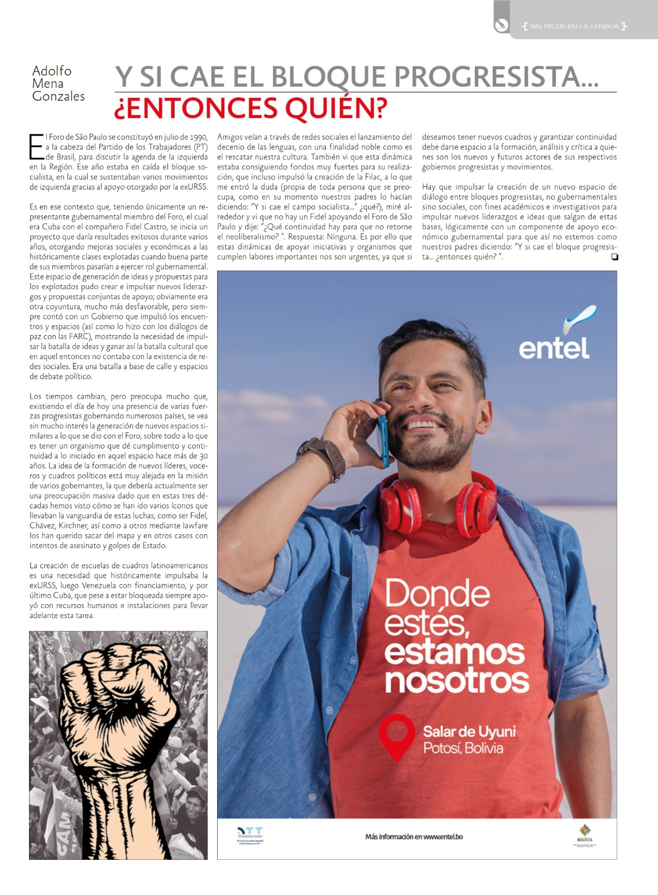

El Foro de Sao Paulo se constituyó en julio de 1990, a la cabeza del Partido de los Trabajadores de Brasil, para discutir la agenda de la izquierda en la región. Ese año estaba en caída el bloque socialista en la cual se sustentaban varios movimientos de izquierda, gracias al apoyo otorgado por la ex **URSS**.

Es en ese contexto que teniendo únicamente un representante Gubernamental miembro del Foro, el cual era Cuba con el compañero Fidel Castro, inician un proyecto el cual tendría resultados exitosos durante varios años, otorgando mejoras sociales y económicas a las históricamente clases explotadas cuando buena parte de sus miembros pasarían a ejercer rol gubernamental, este espacio de generación de ideas y propuestas para los explotados logro generar e impulsar nuevos liderazgos y propuestas conjuntas de apoyo, obviamente, era otra coyuntura, mucho mas desfavorable, pero siempre tuvo un Gobierno (que con lo poco que tenía) impulso estos encuentros y espacios (así como lo hizo con los diálogos de paz con las **FARC**), mostrando que la necesidad de otorgar impulsos a batalla de ideas y ganar así la batalla cultural que en aquel entonces no contaba con la existencia de redes sociales. Era una batalla a base de calle y espacios de debate político.

Los tiempos cambian, pero preocupa mucho que existiendo el día de hoy, presencia de varias fuerzas progresistas gobernando varios paises, se vea sin mucho interés la generación de nuevos espacios similares a lo que se dio con el **FORO**, y mas aun a lo que es tener un organismo que de cumplimiento y continuidad a lo iniciado en aquel foro hace mas de 30 años. La idea de generación de nuevos lideres, voceros, cuadros políticos esta muy alejada en la misión de varios gobernantes, la cual debería en al actualidad ser una preocupación masiva dado que en estos 30 años hemos visto como se han ido varios iconos que llevaban la vanguardia de estas luchas, como ser Fidel, Chavez, Kischner, asi como a tantos otros mediante lawfare los han querido sacar del mapa y en otros casos con intentos de asesinato y golpes de estado.    

La creación de escuelas de cuadros latinoamericanos es una necesidad que históricamente impulsaba la ex **URSS**, luego Venezuela con financiamiento y por último Cuba que pese a estar bloqueado siempre apoyo con recursos humanos y espacios para llevar adelante esta tarea.

Amigos veían a través de redes sociales el lanzamiento del decenio de las lenguas, con una finalidad noble, de rescatar nuestra cultura, también vi que esta dinámica estaba consiguiendo fondos muy fuertes para su realización, la cual incluso impulso la creación de la **FILAC**, a lo que me entro la duda (propia de toda persona que se preocupa, como en su momento nuestros padres se preocupaban diciendo … *y si cae el campo socialista .. que?* ), mire alrededor y vi que no hay un Fidel apoyando el Foro de Sao Paulo y dije que continuidad hay, para que no retorne el Neoliberalismo, respuesta: Ninguna. Es por ello que aunque estas dinámicas de apoyar iniciativas organismos que cumplen labores importantes, no son urgentes, ya que si deseamos tener nuevos cuadros y garantizar continuidad debe darse espacio de formación, análisis critica a quienes son los nuevos y futuros actores de sus respectivos gobiernos progresistas y movimientos.

Hay que impulsar la creación de un nuevo espacio de dialogo entre bloques progresistas, no gubernamentales sino sociales, con fines académicos, investigativos, para impulsar nuevos liderazgos e ideas que salgan de estas bases, lógicamente con un componente de apoyo económico Gubernamental para que asi, no estemos como nuestros padres diciendo…y si cae el bloque progresista… entonces…quien.

Adolfo Mena Gonzales
