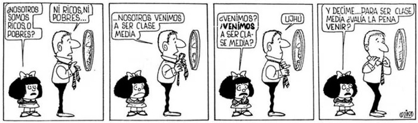

Los bolivianos no tienen alma de esclavos y lo demostraron en las elecciones generales de los últimos quince años. La mayoría elige el camino de la inclusión e integración, este proceso -con sus luces y sombras- transformó el país y exige nuevas dinámicas de convivencia, entre lo tradicional y conservador con lo nuevo y emergente siendo el caso más representativo la clase media.

Entre 2005 a 2018 la pobreza extrema paso de **38,2%** a **15,2%** y la pobreza moderada de **60,6%** a **34,6%** (*INE, 2019*); para el mismo periodo la desigualdad (índice Gini calculado por el Banco Mundial) se redujo de **58,5%** a **42,2%** y para el 2018 Bolivia se convierte en un país con Índice de Desarrollo Humano Alto (*PNUD, 2019*). En términos de ingreso el porcentaje de población con ingresos bajos se redujo de **61%** en 2005 a **37%** en 2017 (*Página Siete, 2018*) o, de otra forma, la población con ingresos medios se incrementó de **35%** a **58%**. Esta movilidad social se traduce en la ampliación de la clase media.

La clase media está compuesta por una clase media conservadora y una clase media emergente. Se diferencian en usos y costumbres desde un carácter xenófilo a un carácter tradicional autóctono. La similitud, dado el nivel de ingreso, está en la demanda casi homogénea de bienes y servicios que tienen a disposición. En este sentido el proceso ha logrado democratizar el mercado.

La clase media en general se caracteriza por ser la “Clase-deseada o clase-objetivo de la democratización y la modernización contemporáneas, pues representa la posesión de las condiciones económicas, políticas y culturales necesarias para tener una vida agradable, significativa, interesante, pacífica y, en general, humana.” (*Molina, 2019*). Asimismo, se caracteriza por ser ambigua y para definirla se debe hacer de forma excluyente según lo que no es. Para Zavaleta (*2009*):  
Nunca logran darse a sí mismas una definición y están condenadas a no ser una clase, pero al mismo tiempo expresan ideológicamente a las clases que luchan y se enfrentan y hacen explícito el pensamiento de las clases nacionales como de la oligarquía y así su destino, naturalmente errátil y éticamente desdichado, es a la vez un destino brillante.

Estas características son más propensas a presentarse en la clase media conservadora ya que están arraigadas en su linaje --que es de por lo menos de tres generaciones--. Esta costumbre provoca que se sienta amenazada al compartir lo que tradicionalmente le pertenencia (espacios de esparcimiento, educación, salud en una mezcla simbólica de apellidos pomposos de origen extranjero con apellidos originarios) con la clase media emergente.

La clase media conservadora ha crecido con el pensamiento economicista donde prima el individuo y actúa como colectivo solo en ciertos eventos que, en su imaginario, afectan su estilo de vida. La calidad de letrado (se podría definir como empleado porque se desenvuelve en actividades prominentemente intelectuales: burocracia, academia, empresariado y otros) genera la tendencia de arribismo social y desprecio a otros estratos que no comparten su pensar. 
 
Al ver comprometido el capital social y cultural por la clase media emergente - y dadas las narrativas racistas y violentas aún presentes ahondadas por la pérdida de espacios de poder de los últimos años - resalta la intolerancia de la clase media conservadora a pesar de pregonar las maravillas de la globalización cultural (dentro de la xenofilia que la caracteriza) y de jactarse de ser ferviente según el culto al que pertenece y de la educación que tiene.

Asimismo, es susceptible a manipulación mediática e intelectual (por su volubilidad y ambigüedad) lo que la lleva al atolondramiento, en particular, de las últimas generaciones (dados los nuevos parámetros de sociabilidad en lo virtual como en lo real) que convierte a este subconjunto en carne de cañón en la guerra de cuarta generación  . Lo que se comprobó con los incendios de la Chiquitania del 2019, la movilización virtual que imploraba auxilio por parte de Influencers – que mostró lo absurdo y ridículo que puede llegar a ser ese movimiento- no se repitió un año después cuando ocurrió el mismo desastre con mayores proporciones mostrando la hipocresía de estos caudillos virtuales.

En manos de la clase media está la economía y política del país y es por esto que la clase media conservadora se disputa estos espacios por cualquier medio (medios de comunicación, grupos de choque, desconociendo elecciones, provocando conflictos). Sin embargo, no se da cuenta que los objetivos que persigue no son propios si no de clases superiores a las que aspira.

La intolerancia, maleabilidad, hipocresía, volubilidad y atolondramiento -características específicas de este, también, especifico segmento de la clase media- es lo que provoca hechos de violencia lamentables como Cochabamba 2007 -recuérdese quien fue el cabecilla-, Sucre y Santa Cruz 2008 , y recientemente fueron parte fundamental del golpe de estado de 2019.

El fascismo se gesta en la clase media, en esa clase media conservadora, cristiana, pudiente y educada. La intolerancia es contagiosa y a nombre de la democracia liberal se constituyen grupos sañosos a los que llamaremos: el lumpen *clasemediero* (Unión Juvenil Cruceñista, Resistencia Juvenil Cochala y derivados.)   
La tragedia de la clase media está en su ambivalencia, tibieza de corazón, visceralidad de acción y en la falta de un objetivo mayor como sociedad. Zavaleta (ob. cit.) reflexionaba al respecto:  
Por su misma ambivalencia, suelen tener muchas explicaciones para cada hecho y explicando y explicando van perdiendo el sentido de la realidad, de los datos gruesos de la realidad y se van enajenando de sí mismas hasta que nadie es culpable de su frustración sino sus imposibles ideas.
El pathos de las capas medias consiste en que nunca o casi nunca descubren de dónde viene su perdición. 

Los principales shocks que golpearon a la economía y sociedad boliviana -uno llamado Coronavirus el otro Jeanine Añez- serán los desafíos más duros que enfrentaremos. Se espera que la movilidad social sea descendente afectando principalmente a la clase media (Castilleja-Vargas, 2020) (Oliva & Serrano Mancilla, 2020).

A pesar que las narrativas destructivas aún están presentes volveremos al camino del crecimiento. Debemos darnos cuenta que un país inclusivo en sus diferencias es posible.

Saldremos adelante.

### REFERENCIAS:
Brigada Octubre. (4 de junio de 2019). Momentos de racismo y discriminación en Bolivia. [Fuente](https://youtu.be/-I6P1XO39ZE)

Campero, G. (21 de septiembre de 2020). Gene Sharp aplicado al proceso electoral Boliviano. [Fuente](https://lavanguardia.netlify.app/publication/gene-sharp-aplicado/)

Castilleja-Vargas, L. (2020). La clase media andina frente al shock del Covid-19. Banco Interamericano de Desarrollo.

INE. (07 de Octubre de 2019). INE: La pobreza en Bolivia se ha reducido. 
[Fuente](https://www.ine.gob.bo/index.php/ine-la-pobreza-en-bolivia-se-ha-reducido/)

Molina, F. (2019). Breve sociología de la clase media boliviana. Bitacora Intercultural, 1(1).

Oliva, N., & Serrano Mancilla, A. (26 de septiembre de 2020). Millones de nuevos pobres en Bolivia.
[Fuente](https://www.celag.org/millones-de-nuevos-pobres-en-bolivia/)

Página Siete. (24 de enero de 2018). Gobierno: Clase media llega a 58%, CEDLA ve vulnerabilidad. 
[Fuente](https://www.paginasiete.bo/economia/2018/1/24/gobierno-clase-media-llega-58-cedla-vulnerabilidad-167552.html)

PNUD. (9 de Diciembre de 2019). Bolivia es clasificado por primera vez como país de “Desarrollo Humano Alto”. 
[Fuente](https://www.bo.undp.org/content/bolivia/es/home/presscenter/articles/2019/bolivia-es-clasificado-por-primera-vez-como-pais-de-desarrollo-h.html)

Zavaleta Mercado, R. (2009). La formación de las clases nacionales. CLACSO.

